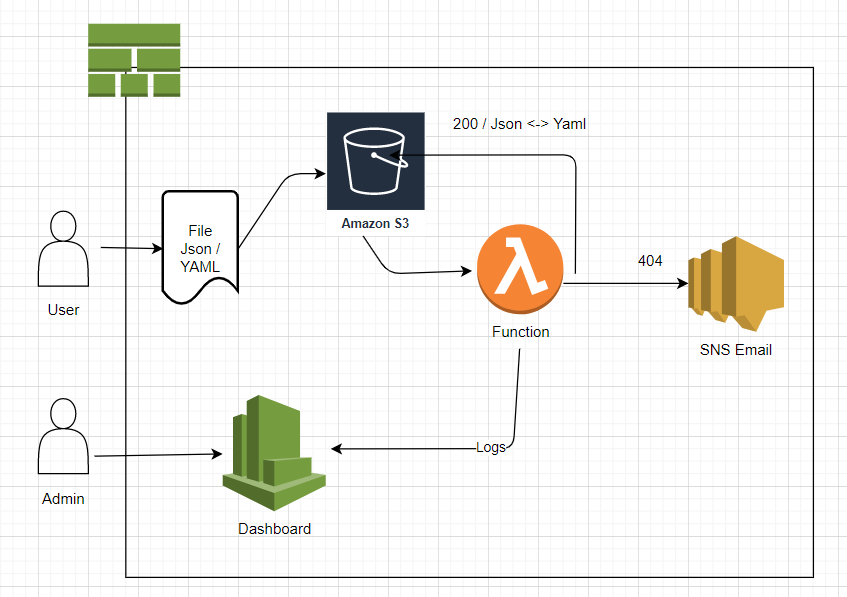

# test-tetra
Cloudformation exercise

```
Here is the Cloud Formation exercise which we would like Fabio to complete
“Create an AWS cloud application packed in a cloudformation template, containing any  resources you think are needed.
Requirements:
1.  One of the template resources will be an s3 bucket. It will be as secure as possible.
2.  Whenever a new file is uploaded to the bucket, the application will:
	- If the file’s extension is yaml, convert it to json and save it to the bucket
	- If the file’s extension is json, convert it to yaml and save the copy to the same bucket
	- If the file has another extension, or if there are any other errors in processing, send a notification to an email address configured as a stack parameter.
	- log to cloudwatch the received file’s name and the number of lines in it.
3. Another template resource will be an IAM role that will allow EC2 instances that assume it to list the bucket contents and to read only the yaml files. 
4. The template will export the ARNs of the bucket and the IAM role.
5. For extra points: the bucket will automatically  be named ‘tetra-<candidate_first_name>-<dow>’ where dow is the day of the week at the time of stack deployment (ie - Monday). Hint - use a custom resource.
6. For extra points: include in the template a cloudwatch graph showing the number of files processed.
Note: The code submitted should be concise, commented and production ready.”
```

# tetra-lambda-transform

An S3 Object Lambda, converting YAML <-> Json

## Introduction

Fetching and transforming data from S3 using AWS Lambda is one of the most common serverless patterns. The new S3 Object Lambda feature allows a Lambda to be invoked on demand as part of the lifecycle of S3 GetObject. This opens up a new set of possibilities. Objects can be transformed, filtered and generated on the fly without adding higher level access points like API Gateways.

## Diagram


## Deployment

The deployment consists of a Lambda Function, IAM Role, Log Group, SNS, Custom Date Resource, Cloudwatch dashboard, S3 Bucket and Access Points.

Deployment uses [The Serverless Framework](https://serverless.com).
```
curl -o- -L https://slss.io/install | bash
```

```
npm install
npx serverless deploy
```

The bucket name and the notification email are set as parameters

```
export candidate_name=fabio
export notification_email=test@test.com
```

## Running

A sample JSON / YAML file is included. To test the function, first copy the files to your bucket.

```
aws s3 cp data/test.json s3://${BUCKET_NAME}/
aws s3 cp data/test.yaml s3://${BUCKET_NAME}/
```

## Logs Cloudwatch


